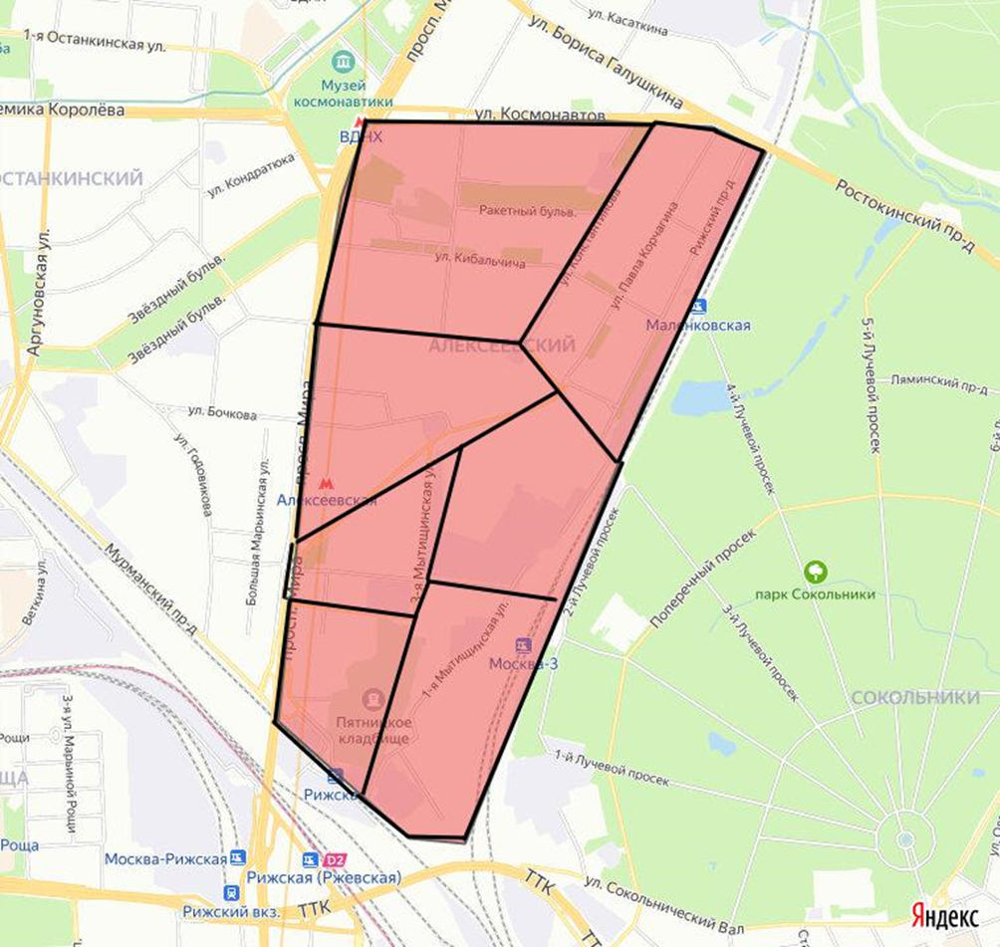
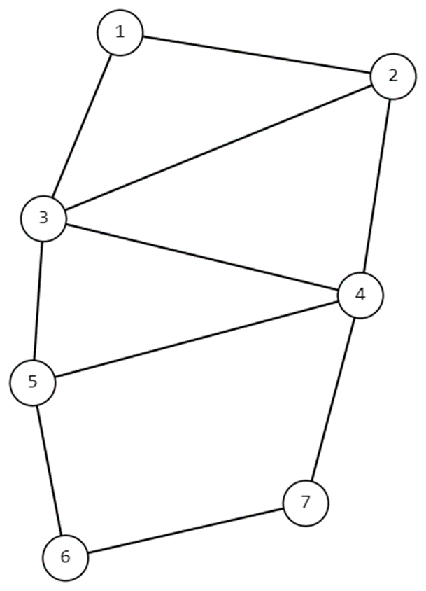
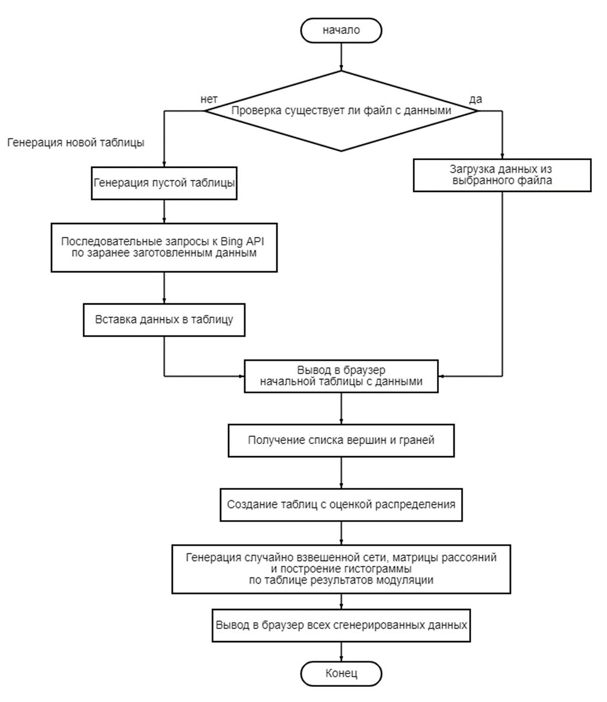

# REPORT ON WORK

## 1. Content Model
A map of the "Alekseevsky" district was used, and 7 microdistricts were selected for potential placement of service points. The microdistricts were chosen based on the concentration of residential areas. The task is to choose a location for a service point within one of the microdistricts so that the travel time by car from the chosen point to the farthest one is minimal. Travel time measurements are made using Bing API, with a total of 30 time measurements for each pair of service points, between which automobile routes are laid.

When setting the task, the following assumptions were made:
- The travel time between two points (start -> end) is equal to the travel time between these two points in the opposite direction (end -> start).
- The size of the microdistrict does not matter within the framework of the task being solved.
- The specific addresses within the microdistricts where it is planned to place the service points and from which the travel time measurements are made are chosen arbitrarily in order to approximately correspond to the geometric center of the selected area; no precise mathematical calculation is made for this.
- When plotting a route between points, it is necessary to be guided by the principles of expediency. For example, if the route between two points passes through a third point, it is assumed that a stop will be made at the third point along the way.

Microdistrict centers:
1. Kibalchicha Street, 9
2. Pavla Korchagina Street, 14
3. Zubarev Lane, 15k2
4. 1st Rizhsky Lane, 2k3
5. Kulakov Lane, 9As1
6. Prospekt Mira, 102s27
7. 1st Mytishchinskaya Street, dv16s10

*Figure 1. Map of the district with marked microdistricts and points*

Having analyzed the conditions of the task and the assumptions, we will represent this map of objects in the form of a graph, where the vertices of the graph are the points inside the microdistricts, and the edges are the automobile routes connecting them.

*Figure 2. Graph representing the map of object placement*

## 2. Algorithm Development

*Figure 3. Program flowchart*

## 3. Program Implementation on a Computer

The algorithm is executed in the Golang language, and the user interface is built in the browser using HTML.

The display of the program's operation in the browser.

Output of the last histogram:

At this stage, 10,000 random weighted distances are generated and a histogram is built according to the number of cases when each vertex becomes optimal for placing a point.

## 4. Conclusion

This program solves the minimax problem of placing a service point in the Adekeevsky district, but it can also be used for any other points on the map (with minor changes to the code). The results of the program's operation will change depending on the day the program is launched, the number of input data, and the number of GSCH generations.

## 5. Ways to launch the application

There are 2 ways to launch: via the console or as an application:
(both commands must be used while in the app folder)
- To launch via the console, just enter the command: "go run .\main.go .\calculation.go .\routeTime.go"
- To launch as an application, use the command: "go build .\main.go .\calculation.go .\routeTime.go", and then run the created binary file.
